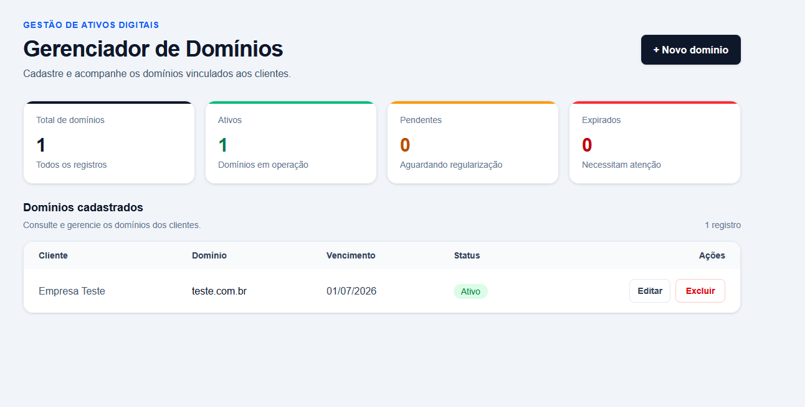
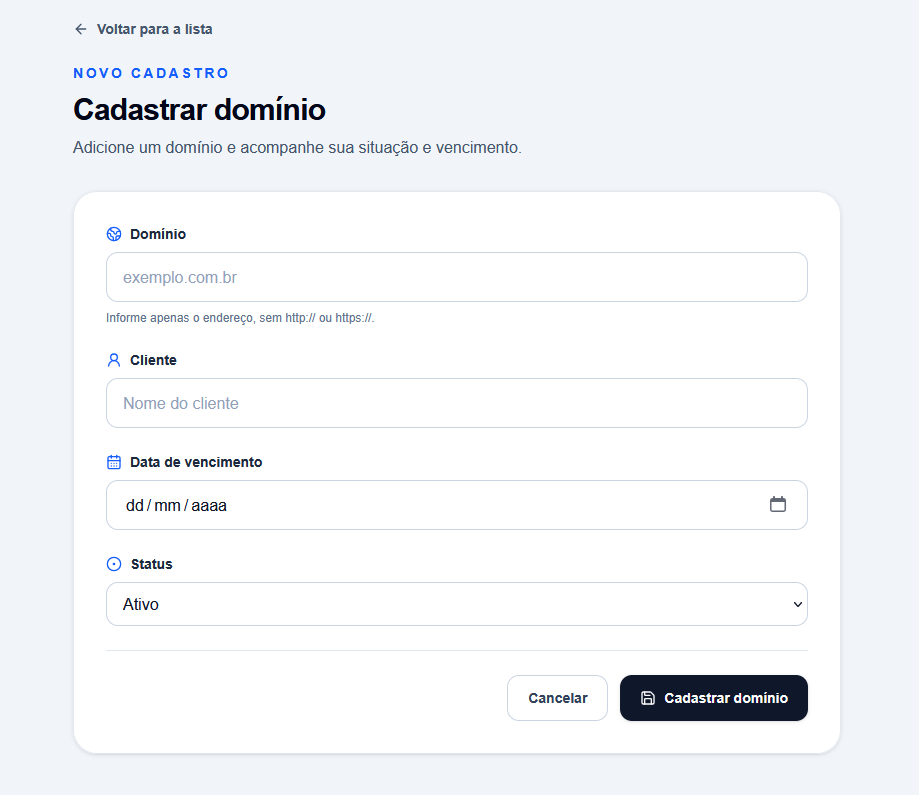

# 🌐 Domain Manager


Sistema Full Stack para gerenciamento de domínios de clientes, desenvolvido com **Next.js**, **Prisma ORM** e **PostgreSQL**. A aplicação permite cadastrar, editar, visualizar e excluir domínios por meio de uma interface moderna e responsiva, consumindo uma API REST construída com Next.js Route Handlers.

## ⭐ Principais Recursos

- CRUD completo de domínios
- API REST construída com Next.js
- Banco PostgreSQL hospedado no Neon
- Prisma ORM
- Deploy automático na Vercel
- Interface responsiva

---

## 📷 Preview

### Tela principal

<p align="center">
  
</p>

### Cadastro



---

## 🚀 Demonstração

🔗 **Aplicação Online:** <https://domain-manager-five.vercel.app/>

---

## ✨ Funcionalidades

- ✅ Listagem de domínios
- ✅ Cadastro de novos domínios
- ✅ Edição de registros
- ✅ Exclusão com confirmação
- ✅ Validação de dados
- ✅ Controle de status
- ✅ Persistência em banco PostgreSQL
- ✅ Interface responsiva

---

## 🛠 Tecnologias

### Front-end

- Next.js 16
- React
- TypeScript
- Tailwind CSS

### Back-end

- Next.js Route Handlers
- Prisma ORM

### Banco de Dados

- PostgreSQL
- Neon Database

### Deploy

- Vercel

### Ferramentas

- Git
- GitHub
- ESLint
- Prisma Migrate

---

## 🎯 Objetivo

Este projeto foi desenvolvido como parte de um desafio técnico com o objetivo de demonstrar conhecimentos em desenvolvimento Full Stack utilizando Next.js, Prisma ORM e PostgreSQL.

O foco foi construir uma aplicação organizada, escalável e de fácil manutenção, aplicando boas práticas de componentização, separação de responsabilidades e integração entre frontend, backend e banco de dados.

---

## 📂 Estrutura do Projeto

```text
src
├── app
│   ├── api
│   └── domains
├── components
│   ├── domains
│   └── ui
├── constants
├── lib
├── services
├── types
└── utils
```

---

## 🗄 Modelo de Dados

| Campo | Tipo |
|--------|------|
| id | Integer |
| name | String |
| clientName | String |
| expirationDate | DateTime |
| status | Enum |
| createdAt | DateTime |
| updatedAt | DateTime |

---

## ⚙️ Instalação

Clone o projeto

```bash
git clone https://github.com/gastaofilho/domain-manager.git
```

Entre na pasta

```bash
cd domain-manager
```

Instale as dependências

```bash
npm install
```

Configure o arquivo

```text
.env
```

```env
DATABASE_URL="postgresql://<username>:<password>@<host>/<database>?sslmode=require"
```

Execute as migrations

```bash
npx prisma migrate deploy
```

Gere o Prisma Client

```bash
npx prisma generate
```

Execute o projeto

```bash
npm run dev
```

---

## 📡 API

| Método | Endpoint | Descrição |
|---------|----------|-----------|
| GET | /api/domains | Lista domínios |
| POST | /api/domains | Cria domínio |
| GET | /api/domains/{id} | Busca domínio |
| PUT | /api/domains/{id} | Atualiza domínio |
| DELETE | /api/domains/{id} | Remove domínio |

---

## 🏗 Arquitetura

O projeto foi estruturado em camadas para facilitar manutenção e reutilização de código.

```
Interface
      │
      ▼
Componentes React
      │
      ▼
Route Handlers
      │
      ▼
Services
      │
      ▼
Prisma ORM
      │
      ▼
PostgreSQL
```
A arquitetura foi organizada em camadas, separando responsabilidades entre interface, regras de negócio e acesso aos dados, facilitando manutenção, reutilização e escalabilidade.

---

## 💡 Principais decisões técnicas

- Componentes reutilizáveis para formulários.
- Separação entre interface, regras de negócio e acesso ao banco.
- Uso do Prisma ORM para abstração das consultas SQL.
- Banco PostgreSQL hospedado no Neon.
- Deploy automatizado utilizando Vercel.
- Código organizado visando escalabilidade e manutenção.

---

## 📈 Melhorias futuras

- Login e autenticação.
- Pesquisa e filtros.
- Paginação.
- Dashboard com indicadores.
- Notificações de vencimento.
- Upload de documentos.
- Testes automatizados.
- Docker

---

## 👨‍💻 Autor

**Gastão Barbosa**

- GitHub: https://github.com/gastaofilho
- LinkedIn: https://www.linkedin.com/in/gastaobarbosa/